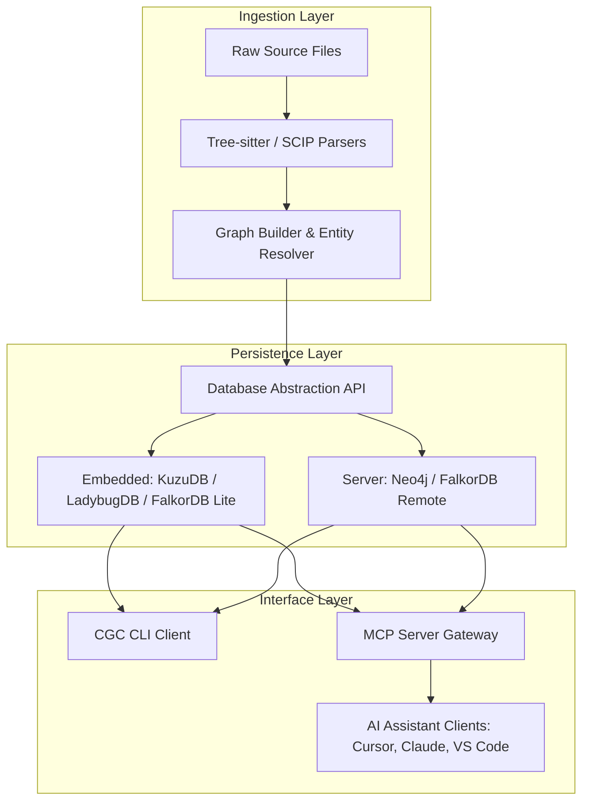
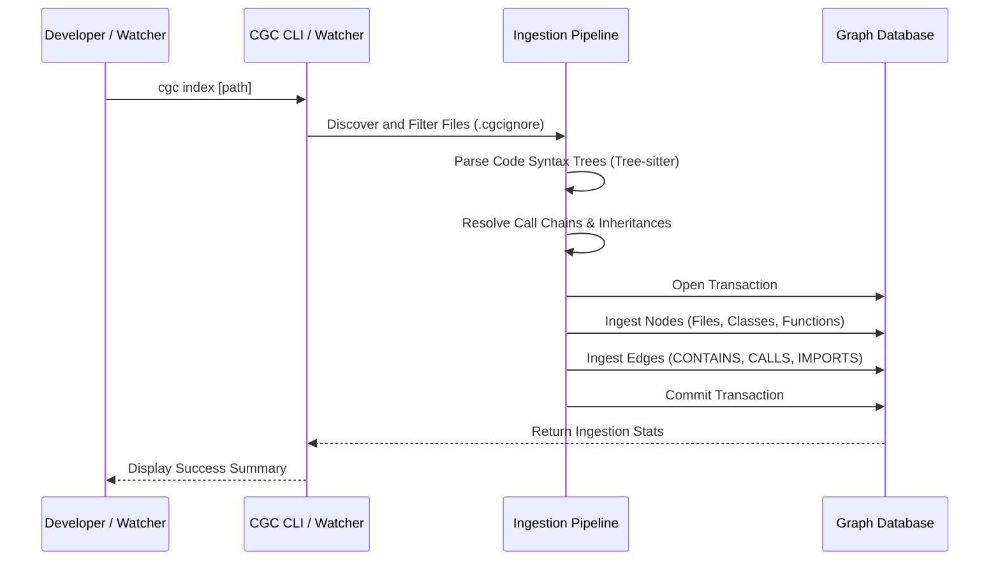
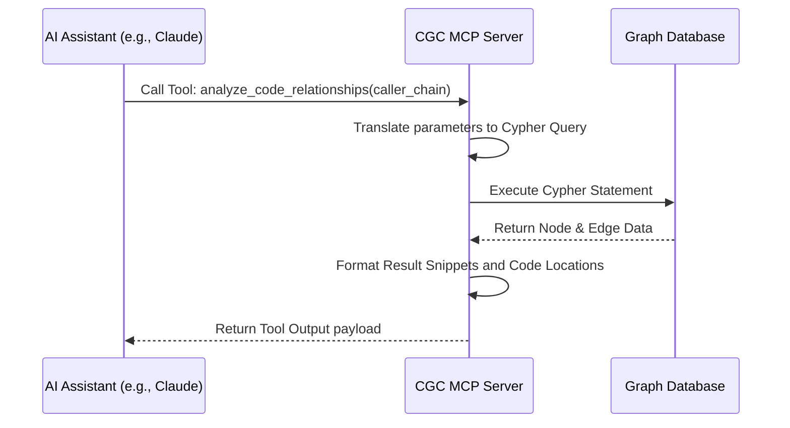

# System Architecture

CodeGraphContext (CGC) is structured as a multi-tier code intelligence pipeline. It acts as the bridge between source code parsers, local/remote graph databases, and client developer tools or AI agents.

---

## High-Level Architectural Layout

CGC consists of three primary layers: **Ingestion**, **Persistence**, and **Interface**.

---

## 1. The Ingestion Layer

The Ingestion Layer is responsible for reading raw codebase directories, parsing code tokens, and constructing the structural property graph.

- **File Discovery & Filtering**: Scans the directory tree. Respects standard `.gitignore` settings and custom `.cgcignore` configurations.
- **Polyglot Parsers**: Utilizes Tree-sitter libraries to generate Concrete Syntax Trees (CSTs) for supported programming languages (Python, Java, JavaScript, TypeScript, Go, C++, etc.).
- **Symbol Linker (SCIP)**: Optionally processes SCIP index data to resolve cross-file references and imported dependency symbols.
- **Reference Resolution**: Resolves target call signatures. If `Function A` in `file_1.py` calls `Function B` in `file_2.py`, this linker creates a directed `CALLS` edge between their respective function nodes.
- **Asynchronous Ingestion Workers**: Processes large codebases concurrently via multi-threaded background workers managed by a internal job controller queue.

---

## 2. The Persistence Layer

The Persistence Layer abstracts database operations so that the engine can interface with multiple graph database systems using a single unified API.

- **Database Abstraction API**: A client layer exposing methods to write batch transactions (`write_nodes`, `write_edges`) and query graph relationships via Cypher or native bindings.
- **Embedded Engines**:
  - **FalkorDB Lite (Default)**: Embedded in-memory graph engine (Unix only).
  - **KuzuDB**: In-process C++ graph engine offering zero-dependency persistence on all platforms.
  - **LadybugDB**: SQL-based embedded graph engine designed for concurrent read/write transactions.
- **Networked Server Engines**:
  - **FalkorDB Remote**: Remote client linking to FalkorDB instances.
  - **Neo4j**: Enterprise-scale storage supporting distributed clustering and the Neo4j web browser console.

---

## 3. The Interface Layer

The Interface Layer exposes the query engine to developer workflows and automated pipelines.

- **CLI (`cgc`)**: Compiled Python script offering utilities to index directories, show statistics (`cgc stats`), execute analysis commands (`cgc analyze`), export/import context bundles, and verify backend readiness (`cgc doctor`).
- **FastAPI HTTP Gateway**: Exposes a REST API (`cgc api start`) to query the code graph over standard HTTP and serve the interactive React visualizer.
- **Model Context Protocol (MCP) Server**: Exposes 21 standard JSON-RPC tools for tool-calling agents.

---

## Core Data Flows

### A. Repository Ingest and Index Pipeline

### B. MCP Query Pipeline

