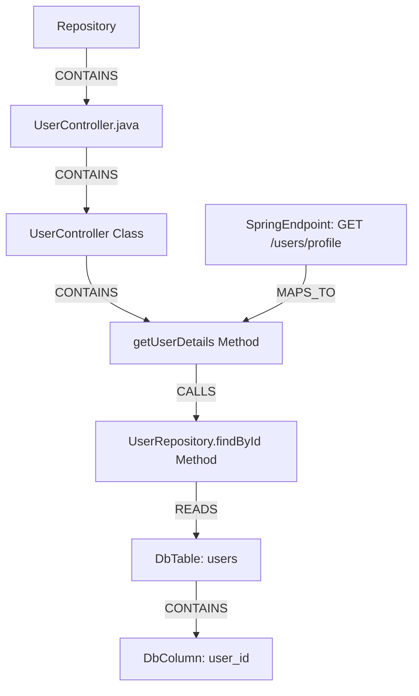

# The Code Graph Model

CodeGraphContext models codebase structures as a directed, attributed **Property Graph**. By mapping files, modules, classes, and functions to distinct nodes, and their interactions to directed edges, the engine provides a semantic representation of your code.

---

## 1. Node Types & Attributes

Nodes represent physical files or structural syntax declarations. Each node has a set of attribute properties.

### Structural Code Nodes

#### `Repository`
The root node representing the indexed codebase workspace.
- `path`: The absolute file path to the repository directory.
- `name`: The directory name of the repository.

#### `File`
Represents a source code file on disk.
- `path`: The path relative to the repository root.
- `language`: The resolved language parser type (e.g., `python`, `typescript`, `java`).
- `hash`: SHA-256 hash of the file contents for tracking changes.

#### `Module`
A namespace or package boundary (e.g., a Python module, Java package, Go package).
- `name`: The full qualified import path of the module.

#### `Class`
Object-oriented class declarations.
- `name`: The class identifier name.
- `path`: The relative file path containing the class.
- `start_line` / `end_line`: The line coordinates in the source file.

#### `Function`
Methods, functions, or subroutines.
- `name`: The function identifier name.
- `path`: The relative file path containing the definition.
- `signature`: The full function parameters and return type signature (if declared).
- `docstring`: Extracted comments and docstrings.
- `complexity`: Computed cyclomatic complexity score.
- `start_line` / `end_line`: Source file line coordinates.

---

### External Integration & Framework Nodes

#### `SpringBean` (Java Spring Framework)
Java classes decorated with Spring stereotype annotations (e.g., `@Component`, `@Service`, `@Repository`, `@Controller`).
- `bean_name`: The resolved identifier of the bean.
- `scope`: The scope of the bean lifecycle (singleton, prototype).
- `stereotype`: The annotation label type.

#### `SpringEndpoint` (Java Spring REST)
HTTP REST controller mappings (e.g., `@GetMapping`, `@PostMapping`).
- `path`: The mapped HTTP endpoint URI pattern.
- `method`: The HTTP method (GET, POST, PUT, DELETE).
- `controller_class`: The class containing the handler definition.

#### `DbTable` (Datasource Schemas)
Database tables imported from SQL schemas.
- `name`: Table identifier name.
- `schema`: The parent database schema/catalog name.

#### `DbColumn` (Datasource Schemas)
Columns inside a database table.
- `name`: Column name.
- `data_type`: SQL data type declaration.
- `is_primary_key` / `is_foreign_key`: Boolean constraints.

#### `RedisKeyPattern` (NoSQL Schemas)
Patterns representing keys in Redis cache databases.
- `pattern`: The key naming pattern (e.g., `user:{id}:profile`).
- `data_type`: Redis data structure (string, hash, list, set).

---

## 2. Directed Relationship Edges

Edges represent structural nesting, import linkages, or execution calls.

| Edge Type | Source Node | Target Node | Semantics / Description |
| :--- | :--- | :--- | :--- |
| **`CONTAINS`** | `Repository` / `File` / `Class` | `File` / `Class` / `Function` | Models physical nesting and scope containment (e.g., File contains Function). |
| **`IMPORTS`** | `File` | `Module` / `File` | Models dependency import linkages (e.g., `import os` or `from models import User`). |
| **`CALLS`** | `Function` | `Function` | Models execution paths: the source function invokes the target function. |
| **`INHERITS`** | `Class` | `Class` | Models object inheritance hierarchy (superclass links). |
| **`IMPLEMENTS`** | `Class` | `Class` | Models implementation of interfaces or abstract classes. |
| **`MAPS_TO`** | `SpringEndpoint` | `Function` | Links a REST endpoint URI handler to its target controller method. |
| **`READS`** | `Function` | `DbTable` / `DbColumn` / `RedisKeyPattern` | Identifies that the function queries or fetches data from the datasource node. |
| **`WRITES`** | `Function` | `DbTable` / `DbColumn` / `RedisKeyPattern` | Identifies that the function inserts, updates, or deletes data in the datasource node. |

---

## 3. Polyglot Schema Example

Below is a conceptual schema illustrating how a Java Spring Controller is parsed, linking REST requests down to database tables:

