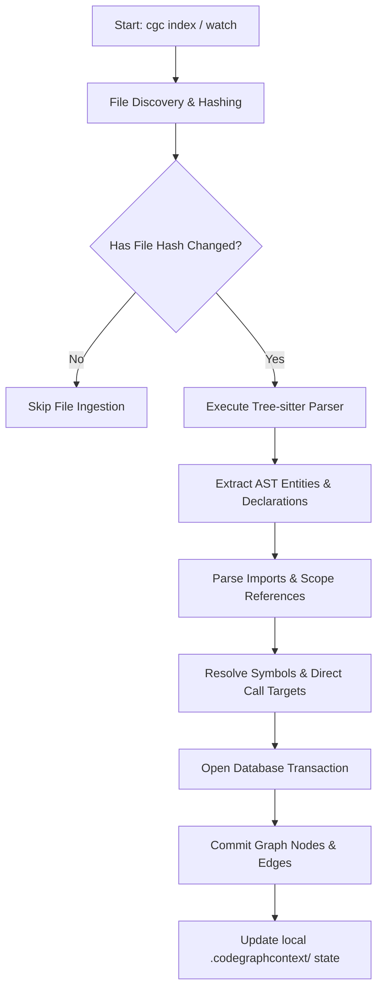

# How Ingestion Works

This guide explains how CodeGraphContext (CGC) parses source files, maps structural relationships, updates indices incrementally, and serves queries.

---

## The Ingest Pipeline Flow



---

## 1. Syntax Parsing & AST Extraction

CGC scans source code using AST parser engines:

### Tree-sitter Grammar Parsing
By default, CGC uses **Tree-sitter** parsers. Tree-sitter generates concrete syntax trees (CSTs) for files:
- CGC registers grammar definitions for 19 target programming languages.
- Language-specific Tree-sitter query files (e.g., `queries/python/tags.scm`) scan the AST to isolate definitions: functions, method names, class structures, parameters, variables, and decorators.
- It records source coordinates (start line, start column, end line, end column) and docstrings.

### SCIP Ingestion (Opt-in)
For large or complex codebases, you can feed a pre-built **SCIP (Sourcegraph Code Intelligence Protocol)** index file into CGC:
- SCIP provides highly accurate cross-module definition-to-reference mappings compiled by compiler front-ends.
- CGC merges Tree-sitter structural declarations with SCIP symbol resolution definitions, which improves cross-file reference accuracy.

---

## 2. Cross-File Reference Resolution

Once declarations are parsed into memory, the engine links dependencies and calls:

- **Containment Linking**: Generates `CONTAINS` relationships mapping a `File` to its child `Class` nodes, and `Class` nodes to their `Function` methods.
- **Import Resolution**: Resolves imports (e.g., `from app.models import User`) to connect file nodes to module namespaces.
- **Call Targets Linker**: When a function contains an invocation name, the resolver searches the symbol index to locate matching target function nodes. If a match is verified, a directed `CALLS` edge is committed.
- **Inheritance Traversal**: Resolves base class relationships, creating directed `INHERITS` or `IMPLEMENTS` edges between class nodes.

---

## 3. Incremental Watching & Synchronization

Re-parsing an entire codebase on every change is slow. CGC handles file writes incrementally:

- **State File Tracking**: CGC stores a database registry tracking every indexed file's path, modification timestamp, and SHA-256 content hash.
- **Filesystem Watcher**: The `cgc watch` command initializes a background watcher using the `watchdog` library.
- **Incremental Updates**:
  1. The watchdog detects a file modification event.
  2. The indexing scheduler recalculates the modified file's SHA-256 hash.
  3. If the hash differs, CGC opens a database write transaction.
  4. It removes the file's old node declarations and relationship edges.
  5. It parses the new file content, resolves its symbols, and commits the updated nodes and edges.
  6. The transaction is committed, ensuring the database remains in sync.

---

## 4. Serving Queries via Cypher

CGC translates CLI requests and MCP tool invocations into **Cypher Queries** that run against the active database.

For instance, calling `cgc analyze callers calculate_total` translates into a Cypher query:

```cypher
MATCH (caller:Function)-[:CALLS]->(callee:Function)
WHERE callee.name = 'calculate_total'
RETURN caller.name, caller.path, caller.start_line
```

By querying the database engine via Cypher, CGC traverses relationships in milliseconds, bypassing the need to search raw source code files in real-time.
