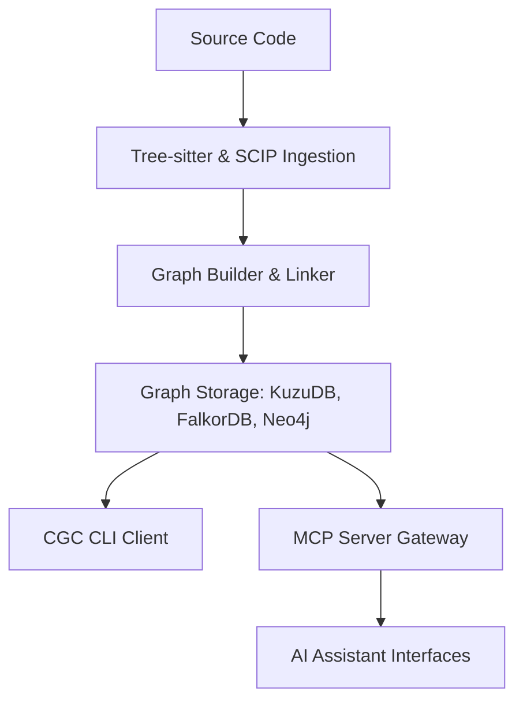

# Introduction to CodeGraphContext

CodeGraphContext (CGC) is a high-performance, developer-focused **Code Intelligence Engine** designed to transform complex source code repositories into semantic, queryable property graphs. By parsing source code syntax and resolving symbols, CGC maps relationships—such as function invocations, class inheritances, file structures, and module imports—into a structured graph model. This enables both human developers and Model Context Protocol (MCP) compatible AI agents to navigate and analyze codebases programmatically.

---

## Core Capabilities

- **Semantic AST Extraction**: Utilizes tree-sitter for syntax analysis and SCIP (Sourcegraph Code Intelligence Protocol) for static symbol resolution across multiple directories.
- **Model Context Protocol (MCP) Integration**: Built-in MCP server support allows AI models and IDE agents (Cursor, Claude, VS Code, Windsurf) to query the codebase context dynamically.
- **Pluggable Database Architecture**: Supports KuzuDB as the default cross-platform embedded database engine, LadybugDB, FalkorDB (embedded and remote), and Neo4j for enterprise analytics and visual exploration.
- **Filesystem Synchronization**: Integrated directory watchers monitor file updates and update the graph incrementally.
- **Portable Code Graphs**: Supports exporting and importing serialized graph representations as `.cgc` bundles for offline sharing and registry integration.

---

## Architectural Layout

CGC acts as the translation layer between source code parsing engines, graph datastores, and consumer clients.

---

## Documentation Roadmap

To get started with CodeGraphContext, follow the structured sections below:

1. **[Getting Started](getting-started/prerequisites.md)**: Explore prerequisites, installation steps, quickstart tutorials, and MCP setup.
2. **[Core Concepts](concepts/architecture.md)**: Deep dive into the architecture, graph model schemas, database backends, and parser designs.
3. **[User Guides](guides/indexing.md)**: Learn indexing strategies, workspaces contexts, bundles distribution, custom visualizers, and database schema mappings.
4. **[Reference Manual](reference/cli.md)**: Complete CLI command listings, MCP tool schemas, and configuration variables.
5. **[Community Portal](contributing.md)**: Guidelines for contributing code, extending languages support, and the project roadmap.
