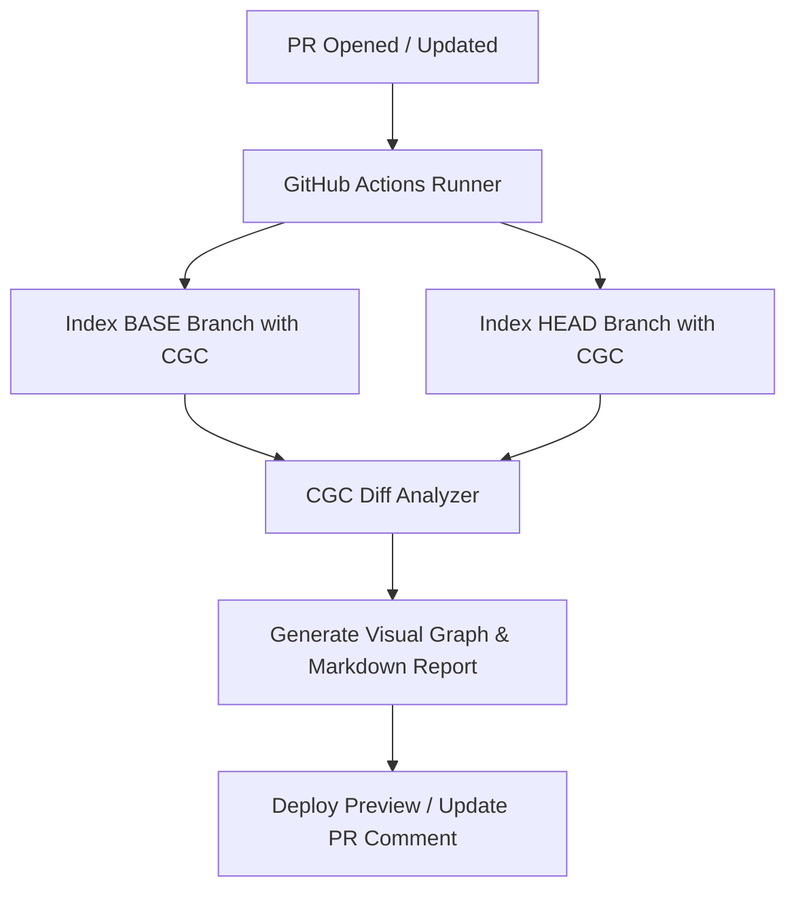

# 🚀 Pull Request Reviewer Code Graph: Design & Strategy Proposal

Visualizing changes in a pull request using a code graph is a game-changer, but only if it solves real developer pain points. Flat, lines-of-code diffs are terrible for understanding context, architecture, and downstream consequences. 

Below is a detailed blueprint to build a **functional, indispensable, and premium Pull Request Code Graph** that teams will actually adopt and rely on daily.

---

## 🗺️ Architectural Concept: How it Works under the Hood

---

## 💡 Cool, Highly-Functional Feature Ideas

### 1. 💥 Visualizing the "Blast Radius" (Impact Zone Graph)
* **The Developer Pain Point:** *"I changed a helper function in a utility file. Did I just break 20 downstream files that rely on its specific return type?"* Flat diffs don't tell you the ripple effect.
* **The Visual Solution:** Color-code and segment the graph into three explicit visual zones:
  * **🔴 Direct Modifications (Red/Green):** The actual classes/functions created, deleted, or changed.
  * **🟠 Primary Impact Zone (Orange):** Immediate callers/dependents of the modified entities.
  * **🟡 Secondary Blast Radius (Yellow + Dotted Edges):** Transitive downstream dependencies up to $N$ hops.
* **Actionable ROI:** Reviewers instantly see the scope of the PR. A 5-line change with a massive blast radius across payment modules will alert the team that it requires extra-rigorous manual review.

---

### 2. 🛡️ Architectural Violations & "Dependency Drift" Guardrails
* **The Developer Pain Point:** Architecture rules are easy to write in documentation but hard to enforce. Developers accidentally import a database adapter into a UI component, or introduce circular dependencies (`A -> B -> C -> A`).
* **The Visual Solution:** Define high-level architectural layers (e.g., `UI`, `Business Logic`, `Data Access`) on the graph nodes.
* **Actionable ROI:** 
  * If a PR introduces an edge that violates boundary rules (e.g., a `UI` component calling `DB` directly without an intermediate `Controller`), the edge is drawn in **blashing purple with a warning sign**.
  * The GitHub Action automatically blocks the PR or tags it: `"Architectural boundary violation detected!"` with a link directly to the violating call path in the graph.

---

### 3. 👻 Dead-Code & Orphan Detector
* **The Developer Pain Point:** Refactoring often leaves "ghost" functions—methods that no longer have any incoming callers but are left in the codebase because developers are afraid to delete them.
* **The Visual Solution:** Identify nodes that have lost all incoming edges (callers) in the HEAD branch.
* **Actionable ROI:** The graph highlights these isolated, floating nodes in grey with a ghost icon 👻. The PR comment reports:
  > **👻 Unreferenced Code Detected!**
  > As a result of this PR, `helpers.parseOldFormat()` has `0` active callers. You can safely delete this function to clean up the codebase.

---

### 4. 🔥 Complexity Heatmap & Risk Score
* **The Developer Pain Point:** In a PR with 50 changed files, how does a reviewer know where to spend 80% of their focus?
* **The Visual Solution:** Use **size-coding** and **glow effects** for nodes:
  * Node size is proportional to **Cyclomatic Complexity Delta** (how much more complex the function became).
  * Node color saturation is based on **File Churn** (how frequently this file is modified in git history).
* **Actionable ROI:** A massive, glowing red node immediately draws the reviewer's eyes: *"This core payment handler just grew by 15 complexity points in a file that changes every week."* Reviewers can focus their attention where the risk is highest.

---

### 5. 🗺️ "Graph-First" Diff Navigation
* **The Developer Pain Point:** Scrolling through a massive GitHub file-diff is exhausting and disorienting.
* **The Visual Solution:** Instead of just a static image, the GitHub Action deploys a lightweight, standalone interactive HTML/JS preview (hosted on Vercel/GitHub Pages or loaded inside VS Code).
* **Actionable ROI:**
  * Reviewers can navigate the diff by clicking nodes on the graph.
  * Clicking a node opens a side panel displaying **only the git diff for that specific function/class**, along with its direct dependencies.
  * Reviewers can add comments directly inside the interactive graph panel, which automatically synchronizes back to the GitHub PR as native line comments!

---

### 6. 📝 Automatic API Signature Change Alerts
* **The Developer Pain Point:** Breaking a function's public signature can silently break downstream callers or external service integration.
* **The Visual Solution:** The diff engine compares node metadata (method signatures, type definitions, exports) between BASE and HEAD.
* **Actionable ROI:** If a signature is altered, the node gets a distinct dashed border, and a neat summary table is appended to the PR description:
  | Symbol | Previous Signature | New Signature | Affected Callers |
  | :--- | :--- | :--- | :--- |
  | `fetchUser` | `fetchUser(id: string)` | `fetchUser(id: string, cache?: boolean)` | `14 files` |

---

## 🛠️ GitHub Action Implementation Strategy (The User Experience)

To make people *adhere* to and *use* this tool, the integration must be seamless and low-friction:

### 1. The PR Comment Summary (Markdown Rich Report)
The GitHub Action posts a beautifully structured comment on the PR containing:
1. **The Visual Graph:** A high-quality SVG or an embedded interactive iframe.
2. **Blast Radius Metric:** e.g., `"This PR modifies 3 functions with a total downstream blast radius of 24 functions across 8 files."`
3. **High-Risk Flags:** Bulleted lists of dead code, complexity surges, or architectural violations.

### 2. A Dedicated VS Code / Cursor Extension View
Developers love staying in their IDEs.
* When a developer opens a PR branch locally, the CGC extension pulls the PR diff graph.
* The IDE shows the "PR Code Graph" directly in a sidebar tab, allowing the developer to review their own changes visually before even pushing to GitHub.

---

## 📊 Summary of Value: Why Developers Will Love It
* **Faster Onboarding for Reviewers:** Instead of reading 1,000 lines of flat diff, a reviewer spends 30 seconds understanding the topological flow of the change.
* **Zero Technical Debt Creep:** Dead code is deleted immediately, and architectural boundaries are guarded on every commit.
* **Safer Deployments:** The blast-radius map ensures developers never say, *"I had no idea changing this function would affect that page!"*
